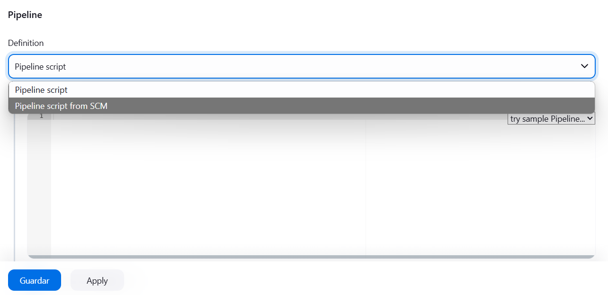
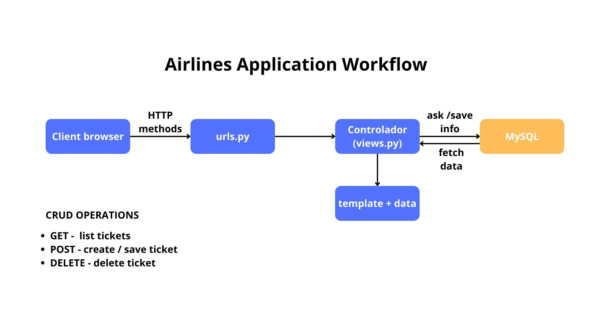
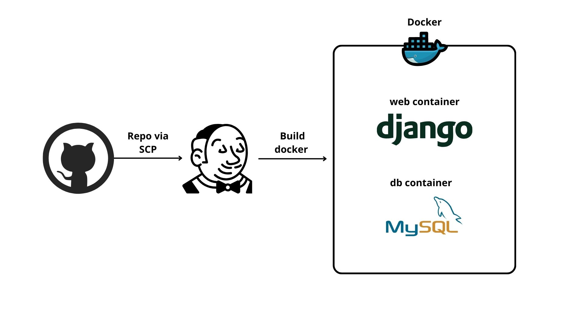
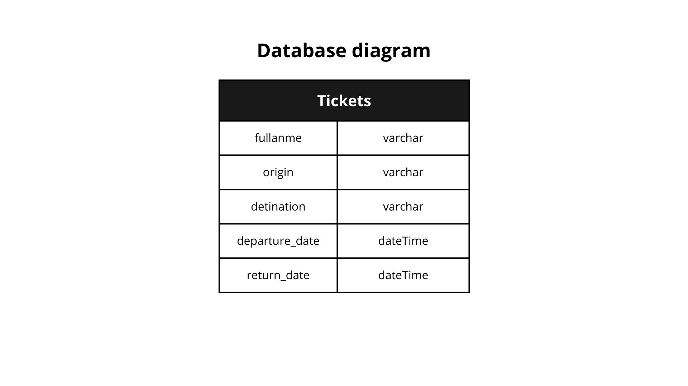

# PIA - Lenguajes modernos de programación

*Alumno: Rubén Daniel Burgos Reyes - 2086230*

Es una aplicación sencilla creada con **django**, estilizada 
con un CDN de **tailwindcss** y en el backend se utitliza
MySQL, para levantar todos los servicios debes ejecutar los 
contenedores de Docker, en CI/CD se usó Jenkins. 

Como requerimientos es necesario tener instalado las últimas
versiones de Docker y Docker Compose en su máquina

## Jenkins Local
Si ya tienes Jenkins local, pasa a la siguiente sección. Para levantar esta aplicación para produccion debe levantar 
localmente Jenkins: 

```shell
cd ./jenkins
```
```shell
docker-compose up
```
Inicia jenkins diciendo que si puedes instalar los plugins recomendados
y agrega un admin. Antes de iniciar el pipeline, te recomiendo hacer un fork
de este repositorio, ya que necesitarás un token para usar SCP
para levantar el pipeline de Jenkins.

### Pipeline
Crea un nuevo pipeline, dale un nombre, luego selecciona SCP  
Seguido ingresa el url de tu repositorio siguiendo el siguiente path

````shell
https://tu_token@url_del_repo
````

Después das guardar y luego ejecutas el pipeline, esto cargara el Jenkinsfile que
incluye el repo y levantará los contenedores Docker

## Especificaciones y código

Dependencias: 
- Django==4.2
- mysqlclient==2.2.6

Puede ver el código en el mismo repo en la rama master: 
https://github.com/redareyes03/airlines_django_app

Este código que esta en `AirlinesProject/settings.py` esta hardocdeado,
para hacerlo más práctico, sin embargo, lo recomendable es un archivo de
variables de entorno, el host es el nombre del contenedor de docker para la base de datos
````js
DATABASES = {
    'default': {
        'ENGINE': 'django.db.backends.mysql',
        'NAME': 'airlines',
        'USER': 'ruben',
        'PASSWORD': 'admin',
        'HOST': 'db',
        'PORT': 3306
    }
}
````
En caso de que quieras correr el proyecto para desarrollo local,
cambia el host por localhost y el usuario por tu usuario de tu 
base de datos local

## Flujo de la aplicación



## Diagrama de tecnologías



## Diagrama de base de datos
Realmente lo deje simple, gracias a las migraciones podrían 
crearse relaciones bastante fácil llegando a ser casi como
un ORM


## Conclusiones 
Fue muy práctico hacer esta aplicación, la verdad en la parte del
CRUD no me lleve mucho tiempo, tampoco creando los contenedores, lo que 
se me complicó más fue la parte de Jenkins, especificamente tuve 
varios problemas con las referencias hacia los archivos dentro
de los contenedores, resulta que para el contenedor `web` le montaba
un volumen local, para desarrollo, sin embargo al momento de hacer
deploy con jenkins estas referencias no estaban, por lo que 
mejor quite el volumen y deje que el Dockerfile copiara los archivos


